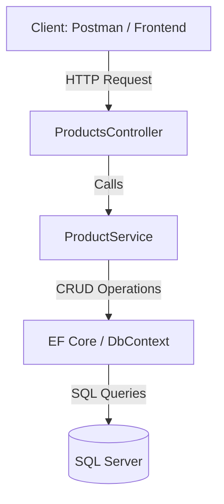

# Product-CRUD-API


## Description
Product-CRUD-API is a simple, scalable, and maintainable RESTful API built with **.NET Core 7**.  
It allows you to manage products with full CRUD functionality and demonstrates **clean architecture principles**, making it ideal for backend projects and portfolio showcase.

## Features
- Create, Read, Update, Delete (CRUD) products
- RESTful API endpoints
- Input validation and error handling
- Entity Framework Core integration with SQL Server
- Unit tests with xUnit
- API documentation using Swagger

## Tech Stack
- **Backend:** .NET Core 7, C#  
- **Database:** SQL Server, EF Core  
- **Testing:** xUnit  
- **Documentation:** Swagger UI  

## Folder Structure
```
Product-CRUD-API/
├── Controllers/      -> API controllers
├── Models/           -> Product entity
├── DTOs/             -> Data Transfer Objects
├── Services/         -> Business logic
├── Data/             -> EF Core DbContext
├── Migrations/       -> EF Core migrations
├── Product-CRUD-API.sln
├── Program.cs
├── appsettings.json
└── README.md
```

## Installation / Setup
1. Clone the repository:
```bash
git clone https://github.com/<username>/Product-CRUD-API.git
```
2. Navigate to project directory:
```bash
cd Product-CRUD-API
```
3. Install the Nuget Packages:
```bash
dotnet add package Microsoft.EntityFrameworkCore
dotnet add package Microsoft.EntityFrameworkCore.SqlServer
dotnet add package Microsoft.EntityFrameworkCore.Tools
dotnet add package Microsoft.EntityFrameworkCore.Design
dotnet add package Swashbuckle.AspNetCore
dotnet add package xunit
dotnet add package xunit.runner.visualstudio
dotnet add package Moq
dotnet add package Microsoft.EntityFrameworkCore.InMemory
```

4. Update the connection string in `appsettings.json`:
```json
"ConnectionStrings": {
    "DefaultConnection": "Server=.;Database=ProductDb;Trusted_Connection=True;"
}
```
5. Apply migrations and run the project:
```bash
dotnet ef database update
dotnet run
```
6. Open Swagger UI for API testing:
```
https://localhost:5001/swagger/index.html
```

## API Endpoints
| Method | Endpoint | Description |
|--------|---------|-------------|
| GET    | /api/products | Get all products |
| GET    | /api/products/{id} | Get product by ID |
| POST   | /api/products | Create new product |
| PUT    | /api/products/{id} | Update product |
| DELETE | /api/products/{id} | Delete product |

## Architecture Diagram


## Unit Tests
- **ProductsControllerTests.cs** → Tests all CRUD endpoints  
- **ProductServiceTests.cs** → Tests business logic  
- Run tests:
```bash
dotnet test
```

## License
MIT License


